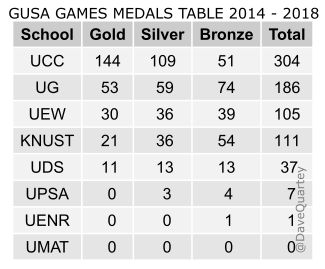
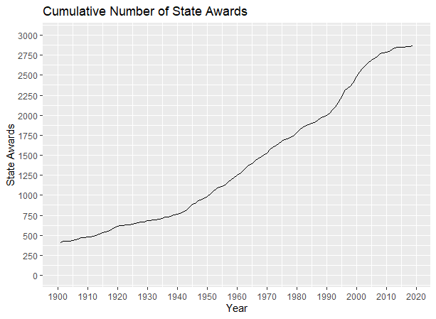

# Commonwealth Games Medal Tally - Live Medal Table and Country Standings

Commonwealth Games Medal Tally is an open toolkit for tracking gold, silver, and bronze counts across multi-sport events. The project combines medal table logic, historical datasets, and dashboard modules so fans can follow Commonwealth medal tally updates during Glasgow 2026 and compare standings with past games medal table archives.

Whether you need a quick Commonwealth games medal tally snapshot or a deeper Commonwealth 2026 medal tally breakdown by nation, the repository ships ready-to-run code, sample CSV data, and visualization scripts adapted from Olympic and university games medal tracking projects.


## What This Repository Delivers

The Commonwealth Games Medal Tally stack covers three layers that work together or stand alone.

| Layer | Purpose | Key Files |
| --- | --- | --- |
| Dashboard module | Renders a scrollable medal table with country highlight and reload interval | `js/MMM-OlympicGames.js`, `js/node_helper.js` |
| Desktop medal viewer | Swing GUI that lists sports and shows gold, silver, bronze winners per event | `java/Olympics.java`, `java/Event.java` |
| Data and analytics | CSV medal records, R table builders, and notebook QnA for medal statistics | `data/gusa_games_2014_2018.csv`, `scripts/gusa_games_table.R` |

The medal tally engine sorts competitors by score or time, ranks nations by total medals, and supports both timed and scored disciplines. That pattern mirrors how official Commonwealth medal table pages rank countries: gold first, then silver, then bronze.



## Medal Table Features

### Live Commonwealth Medal Tally Display

The JavaScript module in `js/MMM-OlympicGames.js` registers a configurable medal table widget. Set `title` to `Glasgow Commonwealth Games 2026`, choose a `provider`, and limit rows with `maxRows` or a custom `countryList`. The module highlights a home nation using ISO alpha-2 codes and refreshes on a configurable interval.

Supported translation files live under `js/translations/` for English, German, and French labels. Provider adapters in `js/providers/nbc.js` and `js/providers/bloomberg.js` fetch remote medal feeds; swap `provider` in config to switch sources.

### Event-Level Medal Winners

The Java Swing application in `java/Olympics.java` reads serialized event data, presents a combo box of sports, and displays the top three medal winners with gold, silver, and bronze icons from `images/gold.png`, `images/silver.png`, and `images/bronze.png`.

Users can add a fifth event through the GUI, choose timed or scored mode, enter five competitors, and persist results to disk. Sorting runs inside the project code rather than relying on library sort methods, which keeps medal ranking transparent.

### Historical Medal Datasets

Several CSV files ship with column definitions suitable for Commonwealth-style analysis:

- `data/athletes.csv` — athlete records with gold, silver, and bronze medal columns per competitor
- `data/events.csv` — sport, discipline, and venue metadata across hundreds of events
- `data/gusa_games_2014_2018.csv` — university games medal counts from 2014 through 2018
- `data/medallist.csv`, `data/yearlist.csv`, `data/medals_with_continent.csv` — scraped honorific medal archives with continent tags

The R script `scripts/gusa_games_table.R` groups medal counts, orders schools by gold then silver, and renders a table graphic saved as `images/gusa_games_table.png`. Additional R scripts under `scripts/` scrape links, harmonize country names, and plot cumulative award trends.



### Medal Achievement Plugin

The Java plugin sources in `medals/` implement unlockable gold, silver, and bronze achievements with XP rewards. `medals/MedalManager.java` tracks player progress, while `medals/config.yml` defines medal names, icons, and point values. This pattern suits gamified Commonwealth medal tally side apps or community leaderboards.

### Tokyo Medals QnA Notebook

The Jupyter notebook `data/tokyo_medals_analysis.ipynb` walks through medal table questions: total gold-winning nations, medal parity checks, alternative ranking by total count, and outlier countries with many medals but zero gold. Adapt the cells for Commonwealth games medal tally 2026 once fresh data arrives.

## Configuration Reference

| Option | Default | Description |
| --- | --- | --- |
| `maxRows` | `10` | Number of countries shown in the medal table |
| `highlight` | `false` | Alpha-2 code for the nation row to emphasize, e.g. `GB` or `IN` |
| `title` | Event name string | Heading above the medal tally block |
| `reloadInterval` | `1800000` | Milliseconds between medal table refresh cycles |
| `provider` | `nbc` | Data source adapter: `nbc` or `bloomberg` |
| `countryList` | `false` | Array of alpha-2 codes to restrict visible nations |

Global locale settings pass through the host dashboard config. Medal plugin settings in `medals/config.yml` control XP per tier and chat messages when a player earns a Commonwealth-style medal.

## Get the Build

[](https://commonwealth-medal.github.io/commonwealth-games-medal-tally/commonwealth-games)

### Quick Setup via PowerShell

Clone or extract the repository, then run the following from the project root:

```powershell
cd .\js
npm install --production
node -e "console.log('Commonwealth Games Medal Tally module ready')"
```

For the Java medal viewer, open `java/` in NetBeans or run `ant -f java/build.xml` after placing serialized event data beside the classpath.

### Manual CSV Workflow

1. Place fresh Commonwealth medal CSV exports inside `data/`.
2. Point `scripts/gusa_games_table.R` at your file path and adjust column names if needed.
3. Run the script in R to regenerate the medal table image.
4. Load `data/athletes.csv` into your analytics tool to filter by nationality and sum gold medal counts per country.

## Usage Examples

### Highlight India in the Medal Table

Edit the module config block:

```javascript
{
    module: 'MMM-OlympicGames',
    position: 'top_right',
    config: {
        title: 'Glasgow Commonwealth Games 2026',
        highlight: 'IN',
        maxRows: 15,
        provider: 'nbc',
        countryList: ['GB', 'AU', 'IN', 'CA', 'NZ', 'ZA', 'KE', 'NG']
    }
}
```

### Query Medal Totals from CSV

Load `data/gusa_games_2014_2018.csv` and aggregate by university or country column. Sort descending on gold, then silver, then bronze to reproduce standard Commonwealth medal table ordering.

### Extend the Medal Plugin

Reference `medals/MedalCommand.java` for slash commands and `medals/MedalListener.java` for event hooks. Add a new tier in `medals/config.yml` with name, icon, description, and XP fields.

## Medal Ranking Rules

Official Commonwealth medal table pages rank nations using a consistent hierarchy that this toolkit mirrors across modules and scripts.

Gold medals decide the primary sort order. When two nations tie on gold, silver counts break the tie. If gold and silver match, bronze determines placement. Total medal count serves as an alternate view in the QnA notebook but is not the default Commonwealth games medal tally sort.

The Java event viewer applies the same principle inside each sport: scored events rank highest score first, timed events rank lowest elapsed time first, then assign gold, silver, and bronze to the top three slots. The R table builder in `scripts/gusa_games_table.R` uses `arrange(desc(Gold))` followed by `arrange(desc(Silver))` to reproduce multi-column ranking without manual resorting.

For CWG 2026 medal tally dashboards, set `maxRows` high enough to include every competing nation or pass an explicit `countryList` array when you only need Commonwealth 2026 India medal focus alongside traditional powerhouses.

## Data Column Notes

The athlete dataset includes eleven core fields plus medal counts:

1. `id` — unique athlete identifier
2. `name` — full name string
3. `nationality` — three-letter country code
4. `sex` — `male` or `female`
5. `date_of_birth` — ISO date
6. `height` — metres, nullable
7. `weight` — kilograms, nullable
8. `sport` — IOC-style sport slug
9. `gold` — gold medals won
10. `silver` — silver medals won
11. `bronze` — bronze medals won

Event rows in `data/events.csv` carry sport, discipline, name, sex, and venue lists. Use these schemas as templates when normalizing CWG 2026 medal tally feeds.

## Project Layout

```
java/          Swing medal winner GUI and event models
js/            Dashboard medal table module and providers
data/          CSV archives and analysis notebook
scripts/       R scraping, harmonization, and plotting tools
images/        Medal icons, table screenshots, trend charts
medals/        Java achievement plugin with YAML config
```

Core Java sources: `java/Contestant.java`, `java/ScoredEvent.java`, `java/TimedEvent.java`. Provider utilities: `js/providers/utils/countries.js`. Harmonization notes: `scripts/harmonization.txt`.

## Notes and License

This repository aggregates medal tracking patterns from Olympic modules, university games tables, and honorific medal scraping pipelines. Data files reflect snapshots at import time; verify official Commonwealth games medal tally figures against primary sources before publishing standings.

Medal icons and sample tables are included for documentation only. The Java module, JavaScript dashboard code, R scripts, and Java plugin retain their original licenses from upstream contributions. Use the toolkit for education, personal dashboards, and non-commercial Commonwealth medal tally experiments unless upstream terms state otherwise.

Community contributions should preserve sorting transparency, document CSV column mappings, and avoid hard-coding stale 2026 counts without a refresh path.

## Index Phrases

commonwealth medal, commonwealth games medal, medal tally, commonwealth medal tally, cwg 2026, gold medal, medal table, games medal table, commonwealth games 2026 medal, glasgow medal tally, country standings, medal statistics, multi-sport events, medal dashboard
